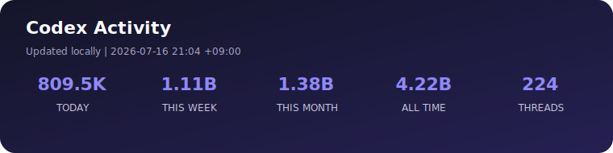

<div align="center">


# yo, 중2 개발자 등장 👾

### `중학교 2학년` · `Flutter dev` · `AI랑 같이 만드는 중`

코딩 수행평가용 아니고 **진짜 사람들이 쓸 앱** 만들고 있어요.  
모르는 건 배우고, 안 되면 고치고, 되면 바로 배포합니다.


</div>

## 🛒 currently building: 바로장터

> 동네 사람들을 연결하는 장터 + 커뮤니티 앱

```text
idea       ██████████  too many
building   █████████░  every day
giving up  ░░░░░░░░░░  0%
```

- 📱 Flutter로 앱 만드는 중
- ⚡ Supabase로 백엔드 굴리는 중
- 🎨 “작동함”에서 끝내지 않고 예쁘고 편하게 다듬는 중
- 🤖 Codex와 같이 만들면서 개발 속도 올리는 중

## 🧃 my stack

<p align="center">
  
</p>

## 🤖 me × Codex



<sub>로컬 통계만 카드로 만들어요. 프롬프트나 개인정보는 공개하지 않습니다.</sub>

## 🕹️ github.exe

<p align="center">
  
  
</p>

<picture>
  <source media="(prefers-color-scheme: dark)" srcset="https://raw.githubusercontent.com/YOUR_GITHUB_USERNAME/YOUR_GITHUB_USERNAME/output/github-contribution-grid-snake-dark.svg" />
  <source media="(prefers-color-scheme: light)" srcset="https://raw.githubusercontent.com/YOUR_GITHUB_USERNAME/YOUR_GITHUB_USERNAME/output/github-contribution-grid-snake.svg" />
  
</picture>

<div align="center">

### school by day · shipping by night 🌙

`아직 중2`가 아니라 **벌써 중2부터 만드는 중.**

</div>
